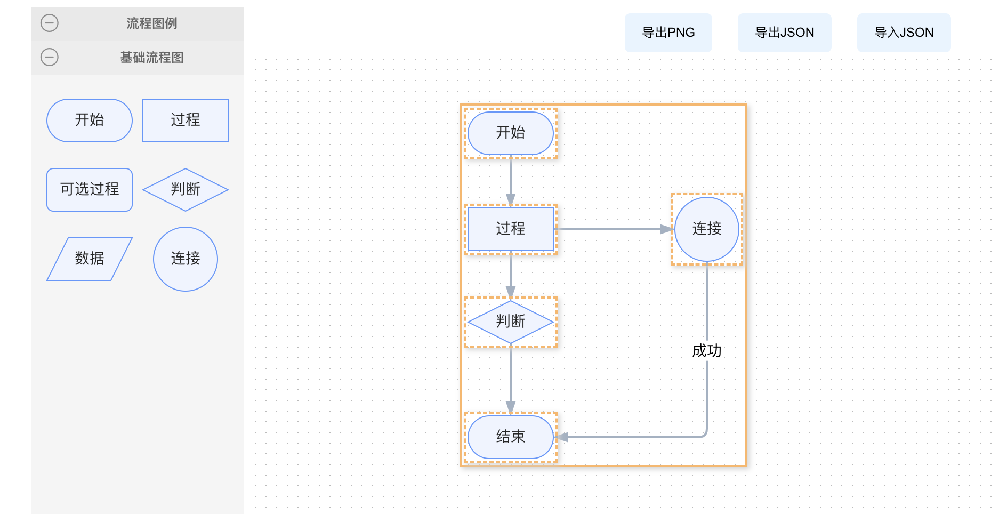

# flow_demo

## Project setup
```
npm install
```

### Compiles and hot-reloads for development
```
npm run serve
```

### Compiles and minifies for production
```
npm run build
```

### Customize configuration
See [Configuration Reference](https://cli.vuejs.org/config/).


#### Antv/x6  2.x 

- Demo环境

```js
    "@antv/x6": "^2.15.2",
    "@antv/x6-plugin-clipboard": "^2.1.6",
    "@antv/x6-plugin-dnd": "^2.1.1",
    "@antv/x6-plugin-export": "^2.1.6",
    "@antv/x6-plugin-history": "^2.2.4",
    "@antv/x6-plugin-keyboard": "^2.2.1",
    "@antv/x6-plugin-selection": "^2.2.1",
    "@antv/x6-plugin-snapline": "^2.1.7",
    "@antv/x6-plugin-stencil": "^2.1.4",
    "@antv/x6-plugin-transform": "^2.1.8",
    "vue": "^2.6.14"
```

- 内容
  - 从0到1在vue2中使用x6 2.x
  - 流程图的拖拽与实现
  - 自定义节点
  - 图形变换、对齐线、快捷键、框选
  - 图形的导出导入

- 样式

    